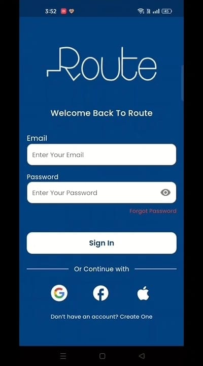
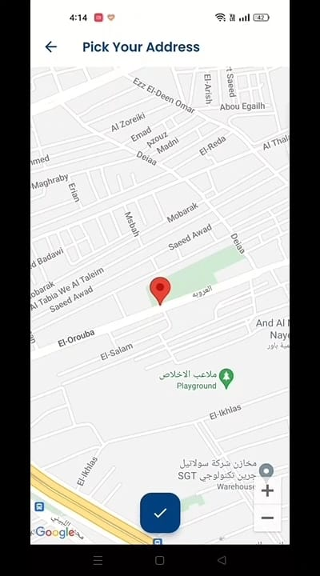
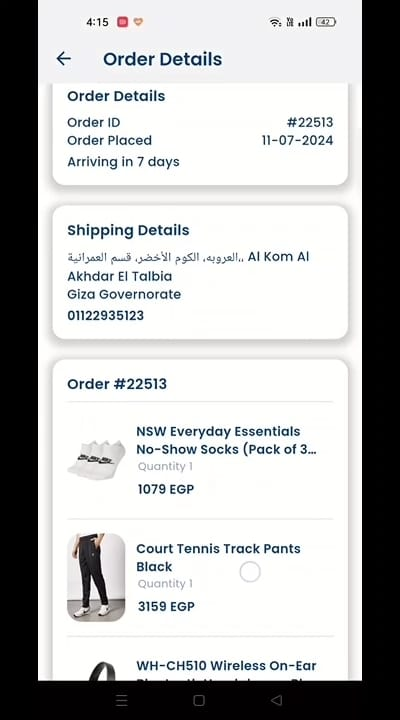

<!DOCTYPE html>
<html lang="en">
<head>
  <meta charset="UTF-8">
  <meta name="viewport" content="width=device-width, initial-scale=1.0">
</head>
<body>
  <header>
    <h1>Route E-Commerce App</h1>
    
Welcome to Route, your go-to destination for convenient and secure online shopping! With Route, you can explore a wide range of products from various brands and categories, add items to your wishlist or cart, and enjoy seamless shopping experiences right at your fingertips.

  </header>
  
  <section>
    <h2>Features</h2>
    <ul>
      <li>Product Exploration: Browse through a diverse selection of products from trusted brands and categories.</li>
      <li>Wishlist and Cart: Easily add items to your wishlist or cart for quick access and purchase.</li>
      <li>Profile Management: Edit your personal information and manage your preferences hassle-free.</li>
      <li>Flexible Payment Options: Pay for your purchases either online or with cash upon delivery.</li>
      <li>User Authentication: Securely sign in or sign up to access your account and enjoy personalized shopping experiences.</li>
      <li>Password Recovery: Forgot your password? No worries! Reset it with just a few simple steps.</li>
    </ul>
  </section>

  ## Screenshots
      
  
      

       

       

      

        

      

    

       

     
  
  <section>
    <h2>Getting Started</h2>
    <ol>
      <li>Download this repository and run the app.</li>
      <li>Sign Up or Sign In: Create a new account or sign in to your existing account to start shopping.</li>
      <li>Explore and Shop: Browse through our wide selection of products, add items to your wishlist or cart, and proceed to checkout.</li>
      <li>Manage Your Profile: Update your personal information and preferences in the Profile tab for a customized experience.</li>
    </ol>
  </section>
  
  <section>
    <h2>Feedback</h2>
    
I'm constantly working to improve the Route app and would love to hear your feedback! If you have any suggestions, questions, or concerns, please don't hesitate to contact me at <a href="mailto:ebrahimtarek2002@gmail.com">ebrahimtarek2002@gmail.com</a>

  </section>
  
  <footer>
    
Happy shopping with Route 🤗

  </footer>
</body>
</html>
